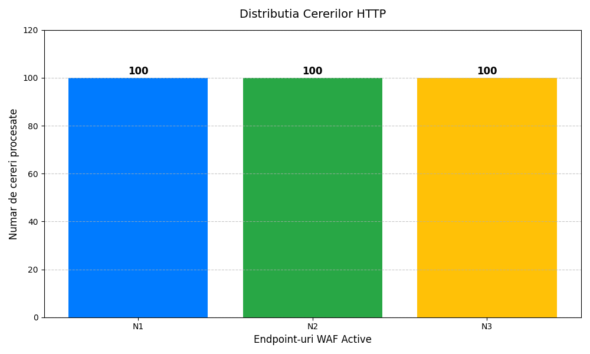
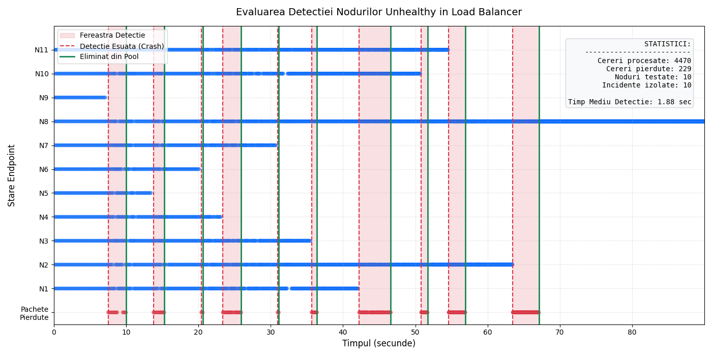
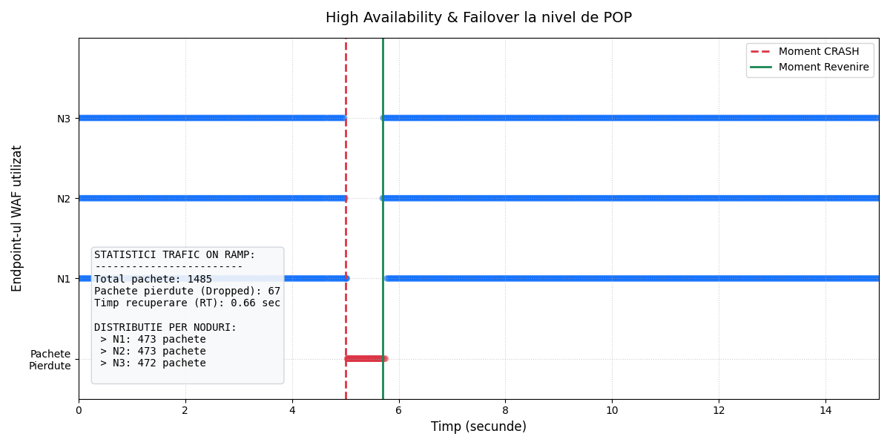
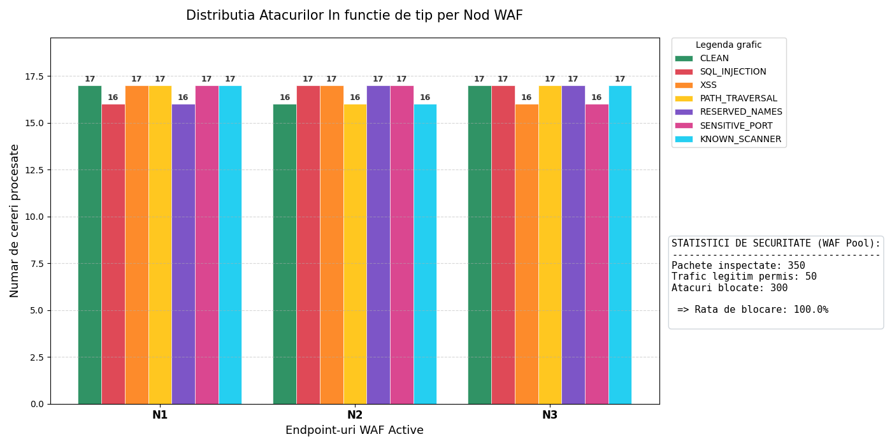
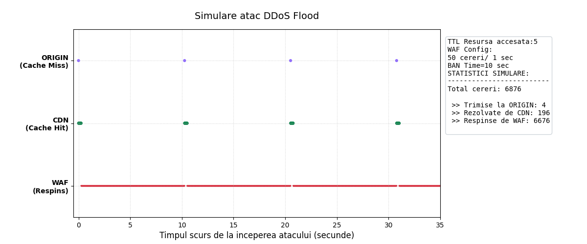
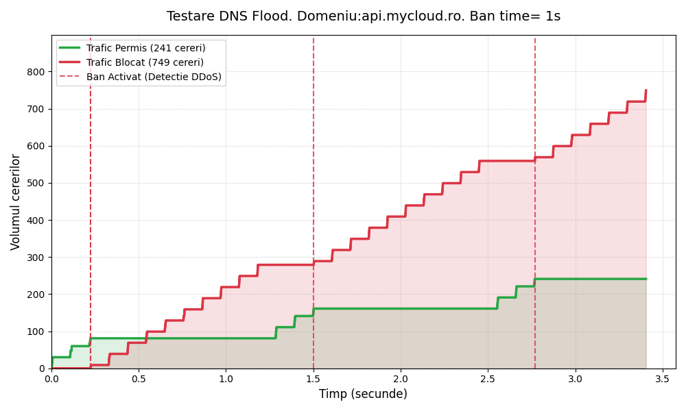

# Cloud-Platform-AntiDDoS

## Update on 31th May 2026
- POP Tested for:
  - Correctness of request distribution logic between healthy Endpoints (Round Robin)
  
  - Multiple endpoint crash simulations (without reboot logic support) and calculation of their average detection time and request redistribution to healthy endpoints
  
  - Simulation of the average recovery time for endpoints after a simultaneous crash (practically the entire POP goes down)
  
  
- WAF Tested for:
  - Per-Endpoint distribution of all types of malicious signatures that can appear in requests: SQL INJECTION, XSS, Path Traversal, Reserved Names, Sensitive Port, Known Scanner, and Clean.
  
  - HTTP DDoS Flood Prevention. With statistics about the request authenticity validation window and Ban time, requests sent to the origin server, and those resolved from CDN Cache HIT
  

      

## Update on 30th May 2026:
- DNS Resolver Tested for:
  - Flood Attacks:
     - on valid addresses
     - on made-up / fake addresses 
     - plus graphs illustrates the real-time evolution (for each case previously mentioned) of a DNS flood attack against a DNS Resolver configured with a 1-second ban timeout, a compact setting chosen specifically to demonstrate how the system transitions between valid traffic processing and malicious traffic mitigation. It visually delimits the exact moments in time when the resolver detects the high volume of requests.
 
 
  - Checking the domain addresses list returned is cyclical rotated each time
  - The Negative Caching
  - The Internal Caching
  - The logic of driving through the Name Domains in order to resolve the address for domain
  

## Update on 29th May 2026:
- The DNS infrastructure:
  - Resolver have implemented support for iterative searches through the NameDomains.
  - The Resolver has implemented tools to detect and block malicious IPs that are engaged in a DNS Request Flood Attack. Dynamic IP Blacklisting implies that every request made by a client will be counted. If their number exceeds a threshold (*DNS_FLOOD_MAX_REQS* requests) within a time window (*DNS_FLOOD_WINDOW* seconds), the client's IP is marked as infected, and requests coming from it will be ignored for a period of time (*DNS_BAN_TIMEOUT* seconds). The manner in which the DNS Resolver handles these requests will be through **DROP** (it no longer constructs a **REFUSED** response) to save computing resources on the server.
  - The connections between the Resolver and the NameDomains are realized through Docker
  - The Resolver also includes logic for saving the addresses found from other searches in its internal memory, as well as saving domains marked with **NXDOMAIN** to prevent a **DNS Random Subdomain Attack**
  - It features support for preventing a **DNS Amplification Attack**. This consists of blocking requests with a qtype of **ANY** and verifying the frequency of requests in relation to the sizes of the requests/responses.
  - There are 3 NameDomains in the network: ROOT, ROTLD, and MYCLOUD, each having the necessary forwarding logic in its database for the Resolver to traverse the network.
  - In MYCLOUD, every protected domain has an associated pool of POPs received cyclically (round-robin).

- The POP Infrastructure:
  - It is responseable for forwarding the request to the WAFs connected in order to perform the following verifications:
    - Layer 7 DDoS Flood Prevention: It checks if the client's IP has sent too many requests. It uses Redis and atomic pipelines to run a Fixed-Window Rate Limiting mechanism. If the IP exceeds the threshold (WAF_FLOOD_MAX_REQS per WAF_FLOOD_WINDOW), it is automatically blocked for a specific time (WAF_BAN_TIMEOUT). All subsequent packets from this IP are dropped immediately at the entry point (on-ramp).
    - Threat Detection (WAF Module): It decodes and normalizes the incoming request paths and bodies (handling percent-encoded URLs according to RFC 3986). Then, it uses regular expressions to find common OWASP attack signatures:
      - SQL Injection (SQLi): Detecting malicious SQL code meant to manipulate the database.
      - Cross-Site Scripting (XSS): Identifying dangerous scripts injected into the request.
      - Path Traversal: Preventing unauthorized access to internal system files (like /etc/passwd).
      - User-Agent Validation: Checking compliance with RFC 9110 rules. It rejects known automated malicious scanners or requests that are missing the User-Agent header entirely.
  - If the request is clean, the system moves from the security layer to the Content Delivery Network (CDN) acceleration phase:
    - CDN Cache Lookup: The WAF computes a unique cache key based on the host domain, request headers and Vary option to look up the resource inside the shared Redis store.
    - Cache HIT (Fast Delivery): If the data is found and is still fresh (based on Cache-Control rules), the server triggers a CDN-HIT and sends the resource back to the user instantly from RAM, bypassing the backend.
    - Cache Validation (ETag Flow): If the cache is expired but contains an ETag, the WAF sends a conditional request to the backend using the If-None-Match header to see if the content actually changed.
    - Cache MISS & Off-Ramp Routing: If the resource is missing or stale, the WAF finds the correct backend address in Redis and forwards the request over the network directly to the Origin Server.
    - Data Retention & Invalidation: When the Origin Server responds, the CDN stores the new resource in Redis **if** (RFC 9111 & RFC 5861) it is cacheable. If the user performs a data-modifying request (like an HTTP POST/ DELETE), the system automatically runs a cache invalidation routine to clear old data and keep the system consistent.

## Update on 20th April 2026:
- In WAF_POP: CDN Implemented but not implemented in WAF
- In WAF_POP: WAF now have implemented rate limit againts DDOS flooding attacks
- In WAF_POP: WAF detect bot requests via User_agent header

## Update on 18th April 2026:
- POP implemented using load balance
- WAF specialized in SQL Injection
- All are incorporated in a Docker image (scalable number of WAFs)

Acest reposiotry constituie lucrarea mea de licenta.

Referinte:
* CloudFlare docs

Pentru DNS Resolver si Name Service
* RFC 1034
* RFC 1035
* RFC 8482 For DNS Amplification

Pentru WAF:
* RFC 3986
* RFC 9110
* RFC 9111
* RFC 7239
* https://owasp.org/Top10/2025/A05_2025-Injection/
* OWASP ModSecurity Core Rule Set (CRS)
* SQL Injection Knowledgebase (via @LightOS) -> http://websec.ca/kb/sql_injection
* SQLi Filter Evasion Cheat Sheet -> http://websec.wordpress.com/2010/12/04/sqli-filter-evasion-cheat-sheet-mysql

Pentru CDN:
* RFC 9110
* RFC 5861
